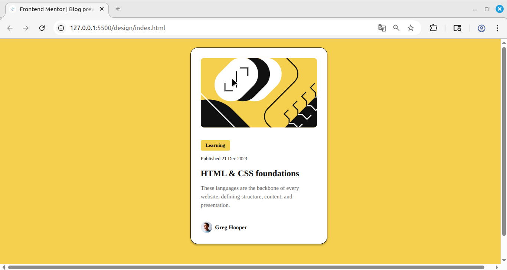

# Frontend Mentor - Blog preview card solution

This is a solution to the [Blog preview card challenge on Frontend Mentor](https://www.frontendmentor.io/challenges/blog-preview-card-ckPaj01IcS). Frontend Mentor challenges help you improve your coding skills by building realistic projects. 

## Table of contents

- [Overview](#overview)
  
  - [Screenshot](#screenshot)
  - [Links](#links)

- [Author](#author)

### Screenshot

### Links

- Solution URL: [https://github.com/CoderAlchemy24/blog-preview.git/](https://github.com/CoderAlchemy24/blog-preview.git)
- Live Site URL: [https://frme-blog-preview.netlify.app/](https://frme-blog-preview.netlify.app/)

## Author

- Website - [@CoderAlchemy24](https://github.com/CoderAlchemy24/blog-preview.git)

